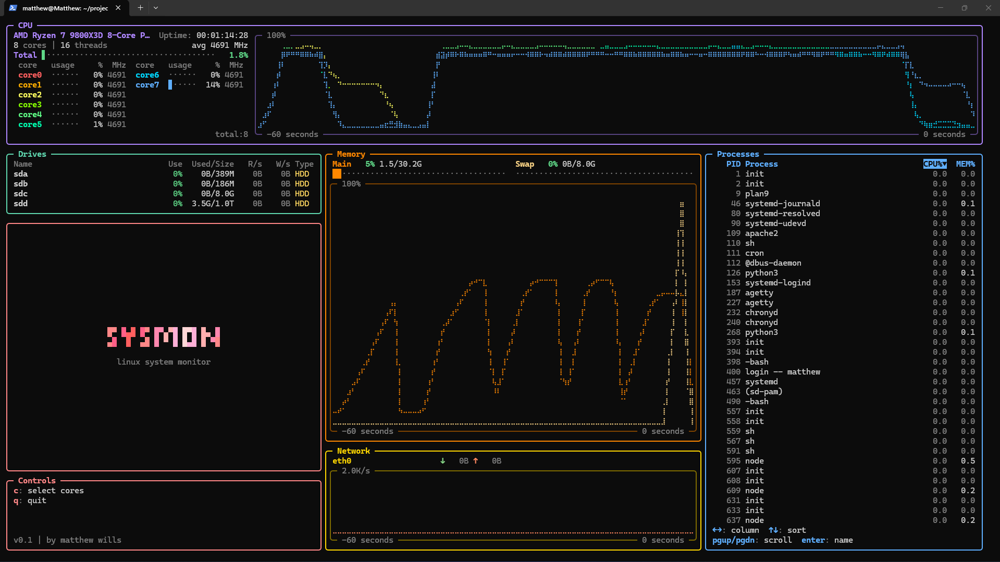
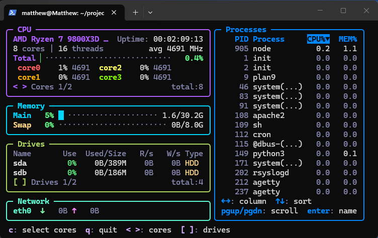

# sysmon

## A CLI system monitor for Linux machines written in C.

sysmon is a real-time system monitor for Linux terminals. It draws a colourful ASCII dashboard complete with live graphs for CPU, memory, GPU, and network activity, read/write information for each drive, per-core CPU information, and a navigable process list.

## Features

- **CPU**: core and thread count, uptime, per-core usage and clock speed, load graph with 60 second history.
- **Memory**: main memory and swap usage, load graph with 60 second history.
- **GPU**: displays detected GPU devices and their usage, memory, and temperature.
- **Network**: upload and download rates for each interface, throughput graph 60 second history.
- **Drives**: usage, size, current read/write information for each drive.
- **Processes**: display all processes, sortable by PID, name, CPU & memory usage.
- **Colour**: built to support 256 colour terminals, can support down to 8 colour terminals and black & white.
- **Themes**: change between built-in themes with --theme, custom themes to come.
- **Compact mode**: automatically adjust UI to fit the terminal, force with --compact.



## Requirements

* Linux
* `gcc` and `make`
* Ideally a 256 colour terminal

## Install & Run

```sh
git clone https://github.com/matthew-wills99/sysmon.git
cd sysmon
make
sudo make install        # installs to /usr/local/bin/sysmon

sysmon
```

To remove:
```sh
sudo make uninstall
```

To build & run in place (no install):
```sh
make
./sysmon
```



## Usage

```
Usage: sysmon [options]
```

| Option | Description |
| --- | --- |
| `-i`, `--interval <ms>` | Refresh interval in milliseconds (100–3600000, default 1000) |
| `--compact` | Draw with no logo or graphs in a smaller footprint |
| `--no-color` | Run without colours |
| `--all-net` | Include non-physical network interfaces |
| `--all-disk` | Include all non-physical block devices |
| `--theme <name>` | Colour theme: `default`, `ocean`, `neon` (default: `default`) |
| `--gpu-info` | Force display GPU section |
| `--gpu-debug` | Display GPU detection info, then exit |
| `-h`, `--help` | Show the help message |
| `-V`, `--version` | Show the version |
